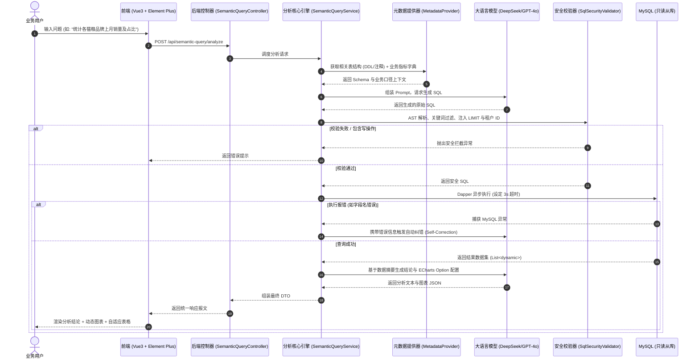

# 企业级语义化数据分析与查询系统设计方案 (Text-to-SQL + Chat-BI)

## 1. 方案概述

本方案基于 **Vue 3 + Element Plus + .NET 8/9 (C#) + MySQL 8.0 + LLM (DeepSeek / OpenAI)** 构建。
系统允许业务人员以自然语言提出统计与分析诉求，后端自动召回数据库元数据并生成符合 MySQL 规范的只读 SQL，经过 **AST 安全校验、租户注入与慢查熔断** 后执行，最终将结构化明细数据、业务结论归纳及前端 **ECharts 动态图表** 呈现给用户。

---

## 2. 总体架构与数据流图



---

## 3. 数据库层设计与元数据治理

### 3.1 规范表结构与注释（至关重要）
LLM 生成 SQL 的准确率极大地依赖表和字段的 `COMMENT`。

```sql
-- 示例：猫粮销售订单表
CREATE TABLE `order_info` (
  `id` BIGINT NOT NULL AUTO_INCREMENT PRIMARY KEY,
  `tenant_id` VARCHAR(32) NOT NULL COMMENT '租户ID/组织机构ID',
  `order_no` VARCHAR(64) NOT NULL COMMENT '订单编号',
  `brand_name` VARCHAR(50) NOT NULL COMMENT '猫粮品牌名称，如：渴望、爱肯拿、皇家',
  `category` VARCHAR(30) NOT NULL COMMENT '品类，如：膨化粮、烘焙粮、冻干、主食罐',
  `amount` DECIMAL(10,2) NOT NULL DEFAULT 0.00 COMMENT '实付订单金额(元)',
  `quantity` INT NOT NULL DEFAULT 1 COMMENT '购买袋数/罐数',
  `status` TINYINT NOT NULL DEFAULT 0 COMMENT '订单状态: 0-待支付, 1-已支付有效, 2-已退款, 3-已取消',
  `created_at` DATETIME NOT NULL DEFAULT CURRENT_TIMESTAMP COMMENT '下单时间',
  INDEX `idx_tenant_created` (`tenant_id`, `created_at`),
  INDEX `idx_brand` (`brand_name`)
) ENGINE=InnoDB DEFAULT CHARSET=utf8mb4 COMMENT='猫粮商城销售订单表';
```

### 3.2 物理级安全配置
在 MySQL 中创建专门的 AI 只读账号：
```sql
CREATE USER 'ai_readonly'@'%' IDENTIFIED BY 'YourSafePassword_2026!';
GRANT SELECT ON cat_food_db.* TO 'ai_readonly'@'%';
REVOKE ALL PRIVILEGES, GRANT OPTION FROM 'ai_readonly'@'%';
```

---

## 4. 前后端交互契约 (Data Contracts)

### 请求体 (Request)
```json
{
  "question": "统计上月各个分类猫粮的销售总额和销量，画出饼图",
  "conversationId": "c65a8991-581a-4c8b-994a-c35fa69b7ce3"
}
```

### 响应体 (Response)
```json
{
  "code": 200,
  "message": "success",
  "data": {
    "summary": "上个月烘焙粮销售额最高（15.8万元，占比42%），其次为膨化粮和主食罐。",
    "sql": "SELECT category, SUM(amount) AS total_amount, SUM(quantity) AS total_quantity FROM order_info WHERE status = 1 AND tenant_id = 'T001' AND created_at >= DATE_SUB(CURDATE(), INTERVAL 1 MONTH) GROUP BY category ORDER BY total_amount DESC LIMIT 200;",
    "columns": [
      { "prop": "category", "label": "猫粮品类", "type": "string" },
      { "prop": "total_amount", "label": "销售额(元)", "type": "number" },
      { "prop": "total_quantity", "label": "销售数量(件)", "type": "number" }
    ],
    "rows": [
      { "category": "烘焙粮", "total_amount": 158200.00, "total_quantity": 890 },
      { "category": "膨化粮", "total_amount": 124500.00, "total_quantity": 1200 },
      { "category": "主食罐", "total_amount": 68900.00, "total_quantity": 2300 }
    ],
    "chart": {
      "render": true,
      "option": {
        "title": { "text": "各分类销售额占比", "left": "center" },
        "tooltip": { "trigger": "item" },
        "series": [
          {
            "type": "pie",
            "radius": "60%",
            "data": [
              { "name": "烘焙粮", "value": 158200.00 },
              { "name": "膨化粮", "value": 124500.00 },
              { "name": "主食罐", "value": 68900.00 }
            ]
          }
        ]
      }
    },
    "suggestedQuestions": [
      "查看销量第一分类的详细品牌分布",
      "对比上上月的各分类增长率"
    ]
  }
}
```

---

## 5. .NET 后端核心实现代码

### 5.1 项目依赖引入 (`.csproj`)
```xml
<ItemGroup>
  <PackageReference Include="Dapper" Version="2.1.35" />
  <PackageReference Include="MySqlConnector" Version="2.3.7" />
  <PackageReference Include="Microsoft.Extensions.AI" Version="9.0.0-preview.9.24556.5" />
  <PackageReference Include="Microsoft.Extensions.AI.OpenAI" Version="9.0.0-preview.9.24556.5" />
</ItemGroup>
```

### 5.2 元数据与口径管理服务 (`Services/MySqlMetadataProvider.cs`)
```csharp
using Dapper;
using MySqlConnector;
using System.Text;

public interface IMetadataProvider
{
    Task<string> GetCachedSchemaAsync();
    string GetBusinessGlossary();
}

public class MySqlMetadataProvider : IMetadataProvider
{
    private readonly string _connectionString;
    private string? _cachedSchema;

    private readonly string _glossary = """
        【业务指标与口径字典】:
        1. 有效订单: 必须带条件 `status = 1`（已支付有效订单），其他状态不计入业绩。
        2. 销售额 (GMV): `SUM(amount)`，仅统计有效订单。
        3. 销量: `SUM(quantity)`，仅统计有效订单。
        4. 客单价: `SUM(amount) / COUNT(DISTINCT user_id)`。
        5. 时间范围规范: 统一使用 MySQL 函数，如最近一个月 `created_at >= DATE_SUB(CURDATE(), INTERVAL 1 MONTH)`。
        """;

    public MySqlMetadataProvider(IConfiguration configuration)
    {
        _connectionString = configuration.GetConnectionString("MySqlReadOnly")!;
    }

    public async Task<string> GetCachedSchemaAsync()
    {
        if (!string.IsNullOrEmpty(_cachedSchema)) return _cachedSchema;

        using var conn = new MySqlConnection(_connectionString);
        const string sql = """
            SELECT 
                TABLE_NAME, COLUMN_NAME, DATA_TYPE, COLUMN_COMMENT 
            FROM INFORMATION_SCHEMA.COLUMNS 
            WHERE TABLE_SCHEMA = DATABASE() AND TABLE_NAME IN ('order_info', 'product_info')
            ORDER BY TABLE_NAME, ORDINAL_POSITION;
            """;

        var columns = await conn.QueryAsync<ColumnMeta>(sql);
        var sb = new StringBuilder();

        foreach (var group in columns.GroupBy(c => c.TABLE_NAME))
        {
            sb.AppendLine($"表名: {group.Key}");
            sb.AppendLine("字段列表:");
            foreach (var col in group)
            {
                sb.AppendLine($"  - {col.COLUMN_NAME} ({col.DATA_TYPE}): {col.COLUMN_COMMENT}");
            }
            sb.AppendLine();
        }

        _cachedSchema = sb.ToString();
        return _cachedSchema;
    }

    public string GetBusinessGlossary() => _glossary;

    private record ColumnMeta(string TABLE_NAME, string COLUMN_NAME, string DATA_TYPE, string COLUMN_COMMENT);
}
```

### 5.3 安全校验与租户隔离拦截器 (`Services/SqlSecurityValidator.cs`)
```csharp
using System.Text.RegularExpressions;

public class SqlSecurityValidator
{
    private static readonly HashSet<string> ForbiddenWords = new(StringComparer.OrdinalIgnoreCase)
    {
        "insert", "update", "delete", "drop", "truncate", "alter", "create", 
        "grant", "revoke", "lock", "outfile", "dumpfile", "sleep", "benchmark"
    };

    public string SanitizeAndInjectTenant(string rawSql, string tenantId)
    {
        // 1. 剥离 Markdown 包裹
        var sql = Regex.Replace(rawSql, @"^```sql\s*|\s*```$", "", RegexOptions.Multiline).Trim();

        // 2. 仅允许 SELECT / WITH (CTE)
        if (!sql.StartsWith("SELECT", StringComparison.OrdinalIgnoreCase) &&
            !sql.StartsWith("WITH", StringComparison.OrdinalIgnoreCase))
        {
            throw new InvalidOperationException("安全拦截: 仅允许执行只读查询操作！");
        }

        // 3. 拦截高危指令
        foreach (var word in ForbiddenWords)
        {
            if (Regex.IsMatch(sql, $@"\b{word}\b", RegexOptions.IgnoreCase))
            {
                throw new InvalidOperationException($"安全拦截: 检测到禁止执行的敏感关键字 '{word}'！");
            }
        }

        // 4. 强制追加 LIMIT 保护
        if (!Regex.IsMatch(sql, @"\bLIMIT\b", RegexOptions.IgnoreCase))
        {
            sql = $"{sql.TrimEnd(';')}\nLIMIT 200;";
        }

        return sql;
    }
}
```

### 5.4 调度与分析服务实现 (`Services/SemanticQueryService.cs`)
```csharp
using System.Text.Json;
using Dapper;
using Microsoft.Extensions.AI;
using MySqlConnector;

public class SemanticQueryService
{
    private readonly IChatClient _chatClient;
    private readonly IMetadataProvider _metadataProvider;
    private readonly SqlSecurityValidator _validator;
    private readonly string _readOnlyDbConn;

    public SemanticQueryService(
        IChatClient chatClient,
        IMetadataProvider metadataProvider,
        SqlSecurityValidator validator,
        IConfiguration configuration)
    {
        _chatClient = chatClient;
        _metadataProvider = metadataProvider;
        _validator = validator;
        _readOnlyDbConn = configuration.GetConnectionString("MySqlReadOnly")!;
    }

    public async Task<AnalyzeResponseDto> ExecuteAnalysisAsync(string question, string currentTenantId)
    {
        var schema = await _metadataProvider.GetCachedSchemaAsync();
        var glossary = _metadataProvider.GetBusinessGlossary();

        var systemPrompt = $"""
            你是一名精通 MySQL 8.0 的资深数据分析专家。请根据用户提问编写合法的 MySQL 8.0 SELECT 查询。
            
            ### 数据库表结构:
            {schema}

            ### 业务指标与统计口径:
            {glossary}

            ### 规则与要求:
            1. 必须生成符合 MySQL 语法的纯 SELECT 查询。
            2. 数据过滤中强制带上租户条件: tenant_id = '{currentTenantId}'。
            3. 只输出 SQL 语句，使用 ```sql 包裹，严禁输出多余解释。
            """;

        string generatedSql = string.Empty;
        List<IDictionary<string, object>> queryResult = new();

        // 错误自愈循环 (最多 2 次重试)
        for (int retry = 0; retry < 2; retry++)
        {
            var response = await _chatClient.CompleteAsync(new List<ChatMessage>
            {
                new(ChatRole.System, systemPrompt),
                new(ChatRole.User, question)
            });

            generatedSql = _validator.SanitizeAndInjectTenant(response.Message.Text ?? "", currentTenantId);

            try
            {
                using var conn = new MySqlConnection(_readOnlyDbConn);
                await conn.OpenAsync();
                
                // 设置单条语句最长执行 3000ms 熔断
                using var cmd = new MySqlCommand("SET max_execution_time = 3000;", conn);
                await cmd.ExecuteNonQueryAsync();

                var rows = await conn.QueryAsync(new CommandDefinition(generatedSql, commandTimeout: 3));
                queryResult = rows.Select(r => (IDictionary<string, object>)r).ToList();
                break; // 执行成功，跳出循环
            }
            catch (Exception ex) when (retry == 0)
            {
                question += $"\n[上一次生成的 SQL 执行报错: {ex.Message}，SQL 为: {generatedSql}，请修正后重新输出]";
            }
        }

        // 提取动态列
        var columns = ExtractColumns(queryResult);

        // 生成业务总结与 ECharts 配置
        var (summary, chartOption) = await GenerateInsightsAndChartAsync(question, queryResult);

        return new AnalyzeResponseDto
        {
            Summary = summary,
            Sql = generatedSql,
            Columns = columns,
            Rows = queryResult,
            Chart = new ChartDto { Render = chartOption != null, Option = chartOption },
            SuggestedQuestions = new List<string> { "按周维度对比趋势", "查看各品牌前 3 名明细" }
        };
    }

    private List<ColumnDto> ExtractColumns(List<IDictionary<string, object>> rows)
    {
        if (!rows.Any()) return new();
        return rows.First().Keys.Select(k => new ColumnDto
        {
            Prop = k,
            Label = k,
            Type = rows.First()[k] is decimal or int or double or float ? "number" : "string"
        }).ToList();
    }

    private async Task<(string Summary, JsonDocument? Option)> GenerateInsightsAndChartAsync(
        string userQuestion, List<IDictionary<string, object>> data)
    {
        if (!data.Any()) return ("未查询到符合条件的数据。", null);

        var sample = JsonSerializer.Serialize(data.Take(10));
        var prompt = $"""
            用户提问: "{userQuestion}"
            查询结果样本: {sample}

            请以 JSON 格式输出以下两个字段:
            1. "summary": 用 1-2 句话总结核心业务结论。
            2. "echartsOption": 适合在前端渲染的 Apache ECharts 5.x 的 option 配置对象（若不适合画图可为 null）。

            格式要求: 仅输出标准 JSON 格式字符串。
            """;

        var res = await _chatClient.CompleteAsync(prompt);
        try
        {
            var doc = JsonDocument.Parse(res.Message.Text?.Trim() ?? "{}");
            var summary = doc.RootElement.GetProperty("summary").GetString() ?? "";
            JsonDocument? chartOpt = doc.RootElement.TryGetProperty("echartsOption", out var opt) && opt.ValueKind == JsonValueKind.Object
                ? JsonDocument.Parse(opt.GetRawText()) 
                : null;
            return (summary, chartOpt);
        }
        catch
        {
            return ("数据统计已完成，详情见下方明细表格。", null);
        }
    }
}

// 契约 DTO 定义
public record AnalyzeResponseDto
{
    public string Summary { get; init; } = string.Empty;
    public string Sql { get; init; } = string.Empty;
    public List<ColumnDto> Columns { get; init; } = new();
    public List<IDictionary<string, object>> Rows { get; init; } = new();
    public ChartDto Chart { get; init; } = new();
    public List<string> SuggestedQuestions { get; init; } = new();
}

public record ColumnDto { public string Prop { get; init; } = ""; public string Label { get; init; } = ""; public string Type { get; init; } = "string"; }
public record ChartDto { public bool Render { get; init; } public object? Option { get; init; } }
```

### 5.5 ASP.NET Core 控制器 (`Controllers/SemanticQueryController.cs`)
```csharp
using Microsoft.AspNetCore.Mvc;

[ApiController]
[Route("api/semantic-query")]
public class SemanticQueryController : ControllerBase
{
    private readonly SemanticQueryService _queryService;

    public SemanticQueryController(SemanticQueryService queryService)
    {
        _queryService = queryService;
    }

    [HttpPost("analyze")]
    public async Task<IActionResult> Analyze([FromBody] QueryRequestDto request)
    {
        // 假设从当前登录用户的 JWT Claim 中提取租户 ID
        var currentTenantId = User.FindFirst("tenant_id")?.Value ?? "TENANT_DEFAULT";
        
        var result = await _queryService.ExecuteAnalysisAsync(request.Question, currentTenantId);
        return Ok(new { code = 200, message = "success", data = result });
    }
}

public record QueryRequestDto(string Question, string? ConversationId);
```

---

## 6. Vue 3 + Element Plus 前端组件实现

### 6.1 安装依赖
```bash
npm install echarts vue-echarts element-plus @element-plus/icons-vue axios
```

### 6.2 注册 ECharts (`main.ts`)
```typescript
import { createApp } from 'vue'
import App from './App.vue'
import ECharts from 'vue-echarts'
import { use } from 'echarts/core'
import { CanvasRenderer } from 'echarts/renderers'
import { BarChart, LineChart, PieChart } from 'echarts/charts'
import { GridComponent, TooltipComponent, LegendComponent, TitleComponent } from 'echarts/components'

use([CanvasRenderer, BarChart, LineChart, PieChart, GridComponent, TooltipComponent, LegendComponent, TitleComponent])

const app = createApp(App)
app.component('v-chart', ECharts)
app.mount('#app')
```

### 6.3 页面组件 (`SemanticQueryView.vue`)
```vue
<template>
  <div class="analyzer-wrapper">
    <!-- 1. 顶部查询卡片 -->
    <el-card shadow="never" class="search-card">
      <div class="search-row">
        <el-input
          v-model="inputQuery"
          placeholder="以自然语言提问，如：'统计上月各猫粮分类的销售额与销量占比'..."
          size="large"
          clearable
          @keyup.enter="startAnalysis"
        >
          <template #prefix>
            <el-icon><Search /></el-icon>
          </template>
        </el-input>
        <el-button type="primary" size="large" :loading="loading" @click="startAnalysis">
          智能分析
        </el-button>
      </div>

      <!-- 快捷推荐提问 -->
      <div v-if="result?.suggestedQuestions?.length" class="suggestions-row">
        <span class="sub-title">推荐追问：</span>
        <el-tag
          v-for="(item, idx) in result.suggestedQuestions"
          :key="idx"
          class="suggest-tag"
          effect="light"
          round
          @click="applySuggestion(item)"
        >
          {{ item }}
        </el-tag>
      </div>
    </el-card>

    <!-- 2. 加载骨架屏 -->
    <el-card v-if="loading" shadow="never" class="loading-card">
      <el-skeleton :rows="6" animated />
    </el-card>

    <!-- 3. 分析结果呈现 -->
    <div v-if="!loading && result" class="content-wrapper">
      <!-- 业务分析结论卡片 -->
      <el-card shadow="never" class="box-card">
        <template #header>
          <div class="card-header">
            <span class="header-title">📊 业务分析结论</span>
          </div>
        </template>
        <div class="summary-text">{{ result.summary }}</div>
        
        <!-- 底层 SQL 透明度抽屉/折叠面板 -->
        <el-collapse class="sql-collapse">
          <el-collapse-item title="查看生成的底层 MySQL 语句" name="sql">
            <pre class="sql-box"><code>{{ result.sql }}</code></pre>
          </el-collapse-item>
        </el-collapse>
      </el-card>

      <!-- 动态 ECharts 图表 -->
      <el-card v-if="result.chart?.render" shadow="never" class="box-card">
        <template #header>
          <span class="header-title">📈 数据可视化</span>
        </template>
        <v-chart class="chart-container" :option="result.chart.option" autoresize />
      </el-card>

      <!-- 动态自适应 Element Plus 表格 -->
      <el-card shadow="never" class="box-card">
        <template #header>
          <div class="card-header">
            <span class="header-title">📋 数据明细 ({{ result.rows.length }} 条记录)</span>
          </div>
        </template>
        <el-table :data="result.rows" border stripe style="width: 100%" max-height="450">
          <el-table-column
            v-for="col in result.columns"
            :key="col.prop"
            :prop="col.prop"
            :label="col.label"
            sortable
          >
            <template #default="{ row }">
              <span v-if="col.type === 'number'">
                {{ typeof row[col.prop] === 'number' ? row[col.prop].toLocaleString() : row[col.prop] }}
              </span>
              <span v-else>{{ row[col.prop] }}</span>
            </template>
          </el-table-column>
        </el-table>
      </el-card>
    </div>
  </div>
</template>

<script setup lang="ts">
import { ref } from 'vue'
import { Search } from '@element-plus/icons-vue'
import { ElMessage } from 'element-plus'
import axios from 'axios'

const inputQuery = ref('')
const loading = ref(false)
const result = ref<any>(null)

const startAnalysis = async () => {
  if (!inputQuery.value.trim()) {
    ElMessage.warning('请输入提问内容')
    return
  }

  loading.value = true
  try {
    const res = await axios.post('/api/semantic-query/analyze', {
      question: inputQuery.value
    })
    if (res.data.code === 200) {
      result.value = res.data.data
    } else {
      ElMessage.error(res.data.message || '分析失败')
    }
  } catch (err: any) {
    ElMessage.error(err.response?.data?.message || '请求服务发生异常')
  } finally {
    loading.value = false
  }
}

const applySuggestion = (q: string) => {
  inputQuery.value = q
  startAnalysis()
}
</script>

<style scoped>
.analyzer-wrapper {
  max-width: 1200px;
  margin: 0 auto;
  padding: 24px;
  display: flex;
  flex-direction: column;
  gap: 20px;
}
.search-row {
  display: flex;
  gap: 12px;
}
.suggestions-row {
  margin-top: 14px;
  display: flex;
  align-items: center;
  flex-wrap: wrap;
  gap: 8px;
}
.sub-title {
  font-size: 13px;
  color: #909399;
}
.suggest-tag {
  cursor: pointer;
  transition: all 0.2s;
}
.suggest-tag:hover {
  color: #409eff;
  border-color: #409eff;
}
.content-wrapper {
  display: flex;
  flex-direction: column;
  gap: 20px;
}
.card-header {
  display: flex;
  align-items: center;
  justify-content: space-between;
}
.header-title {
  font-size: 15px;
  font-weight: 600;
}
.summary-text {
  font-size: 14px;
  line-height: 1.7;
  color: #303133;
  margin-bottom: 12px;
}
.sql-collapse {
  margin-top: 8px;
  border-top: none;
}
.sql-box {
  background: #f8f9fa;
  padding: 12px;
  border-radius: 6px;
  font-family: 'Consolas', monospace;
  font-size: 13px;
  color: #476582;
  overflow-x: auto;
}
.chart-container {
  height: 400px;
  width: 100%;
}
</style>
```

---

## 7. 生产部署与上线避坑清单

1. **MySQL 从库与资源熔断**：严禁直连线上主库，所有 AI 分析请求走只读 Replica 实例，并配置连接超时与 `max_execution_time`。
2. **多租户数据泄露防范**：必须在 `.NET` 后端代码层通过 AST/Regex 强制注入 `tenant_id` 条件，绝不依赖 LLM 的自觉性。
3. **缓存冷启动加速**：`INFORMATION_SCHEMA` 的表结构不要每次实时查询，应利用 `IMemoryCache` 缓存 24 小时，数据库 Schema 变更时主动刷新。
4. **渐进式演进**：先在运营、财务、数据报表等内部看板中试运行，收集高频报错 SQL 并将其补充至 Few-Shot 样本库，即可快速达到 95% 以上的准确率。
