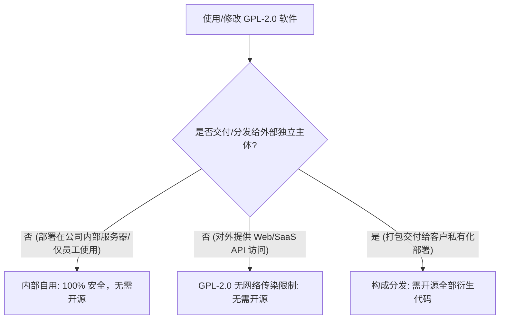
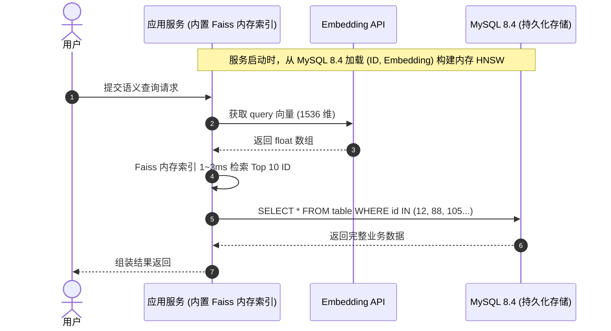

# MySQL 向量检索、版本演进与语义化查询实践指南

本指南系统性总结了 MySQL 对向量（Vector）特性的支持情况、版本演进细节、开源许可（GPL-2.0）合规性边界，以及在 **MySQL 8.4 LTS** 生产环境下结合**外部大模型 API**实现语义化查询的四大落地架构方案。

---

## 目录

- [一、MySQL 向量特性与版本支持真实情况](#一mysql-向量特性与版本支持真实情况)
- [二、常见网络误传与概念辨析](#二常见网络误传与概念辨析)
- [三、GPL-2.0 许可证在企业内部系统的合规性](#三gpl-20-许可证在企业内部系统的合规性)
- [四、MySQL 8.4 落地语义查询的四大实战方案](#四mysql-84-落地语义查询的四大实战方案)
  - [方案一：LLM 语义改写 + MySQL 原生全文索引 (推荐)](#方案一llm-语义改写--mysql-原生全文索引-推荐)
  - [方案二：应用层内存向量索引 (Faiss / USearch)](#方案二应用层内存向量索引-faiss--usearch)
  - [方案三：Text-to-SQL (面向结构化业务数据)](#方案三text-to-sql-面向结构化业务数据)
  - [方案四：数据写入期语义结构化与标签化](#方案四数据写入期语义结构化与标签化)
- [五、方案选型对比与决策树](#五方案选型对比与决策树)

---

## 一、MySQL 向量特性与版本支持真实情况

### 1. 官方版本支持路线

| 版本系列 | 发布类型 | 是否原生支持 `VECTOR` | 内置向量函数 | 说明 |
| :--- | :---: | :---: | :---: | :--- |
| **MySQL 8.0.x (含 8.0.31)** | GA 历史稳定版 | ❌ 不支持 | ❌ 无 | 只能存为 `JSON` / `BLOB` 依靠外部计算。 |
| **MySQL 8.4 LTS** | 长期支持版 (2024.04) | ❌ 不支持 | ❌ 无 | 追求长期极致稳定，未合入实验性质的向量类型。 |
| **MySQL 9.0+** | Innovation 创新版 (2024.07) | ✅ **原生内置** | ✅ **内置** | 首次引入原生 `VECTOR` 数据类型与距离计算函数。 |

### 2. MySQL 9.0+ 原生向量特性规格

* **数据类型**：`VECTOR(M)`
  * `M` 表示维度（Dimension），默认值为 2048，最大支持 16,383 维。
  * 内部存储为单精度浮点数数组（Float32，每维占 4 字节）。
* **核心内置函数**：
  * `DISTANCE(v1, v2, 'metric')` / `VECTOR_DISTANCE()`：计算向量距离（支持 `'COSINE'`, `'EUCLIDEAN'`, `'DOT'`）。
  * `STRING_TO_VECTOR('[-0.01, 0.23, ...]')`：将字符串/JSON 格式转换为二进制 `VECTOR`。
  * `VECTOR_TO_STRING(v)`：将 `VECTOR` 二进制转换为可读字符串。
  * `VECTOR_DIM(v)`：获取向量的维度数。
* **原生局限性**：
  * 标准开源社区版的 MySQL 9.0 仅提供距离计算函数，**默认采用全表暴力扫描（Brute-force Scan）**，尚未内置类似 PGVector 的原生 HNSW/IVFFlat 向量索引。
  * Oracle 官方的 **MySQL HeatWave**（云托管版）才提供硬件级加速的向量索引库。

---

## 二、常见网络误传与概念辨析

网络上部分文章声称：*“MySQL Server版本 >= 8.0.31 默认包含 MySQL Vector 扩展”*。**此说法是不准确的**，其来源主要有以下三种混淆：

1. **混淆了国内云厂商的定制内核**：
   * 阿里云（PolarDB for MySQL 8.0）、腾讯云（TDSQL-C）、火山引擎等云厂商，常以 MySQL 8.0.31 作为自研内核基线，并在内核级自研挂载了向量检索插件（如 `polar_vector`）。
2. **张冠李戴了 PostgreSQL 的生态概念**：
   * PostgreSQL 拥有非常著名的 `pgvector` 扩展（通过 `CREATE EXTENSION vector;` 启用）。部分低质量技术博客或大模型批量生成内容时，将 PG 的插件机制直接套用到了 MySQL 8.0.31。
3. **第三方非官方插件（如 `MyVector`）**：
   * 开源社区有开发者基于 MySQL 8.0/8.4 的 Server Component 架构开发了 `MyVector` 插件以支持 HNSW 索引，但这**绝对不是 MySQL 官方自带或默认包含的**，需要自行编译安装。

---

## 三、GPL-2.0 许可证在企业内部系统的合规性

对于企业内部系统（如内部 OA、ERP、数据中台、微服务等），使用、集成或修改 GPL-2.0 协议的软件：

> **结论：完全合规、极其安全，绝对不需要开源任何企业内部代码。**

### 1. 核心法律逻辑：分发触发原则
* GPL-2.0 的“开源传染性（Copyleft）”只在**向外部第三方分发/传播（Distribution / Conveying）二进制软件时**才会被触发。
* **内部使用（Internal Use）**：部署在公司内部私有服务器供员工使用，在法律上不构成“分发”，因此无论如何魔改源码，代码都属于企业私有，**无任何开源义务**。

### 2. 常见场景判定表



* **安全边界**：只要不将包含 GPL-2.0 代码的安装包/镜像作为商品交付部署到外部客户的机房中，就没有任何合规风险。

---

## 四、MySQL 8.4 落地语义查询的四大实战方案

在不修改 MySQL 8.4 LTS 底层引擎、不引入复杂 C++ 插件的前提下，结合**外部大模型 API**（如 OpenAI、DeepSeek、Qwen 等），有以下四种成熟方案：

---

### 方案一：LLM 语义改写 + MySQL 原生全文索引 (推荐)

**核心思想**：利用大模型将用户的模糊自然语言转化为同义词丰富的“布尔检索表达式”，再利用 MySQL 8.4 原生内置的 `ngram` 全文索引执行毫秒级检索。


#### 1. MySQL 8.4 建立原生中文全文索引
```sql
-- MySQL 8.4 原生内置 ngram 分词器，无需安装任何额外插件
CREATE TABLE articles (
    id INT AUTO_INCREMENT PRIMARY KEY,
    title VARCHAR(255) NOT NULL,
    content TEXT NOT NULL,
    FULLTEXT INDEX ft_title_content (title, content) WITH PARSER ngram
) ENGINE=InnoDB DEFAULT CHARSET=utf8mb4;
```

#### 2. 大模型 Prompt 设计（提取同义词布尔表达式）
```text
你是一个搜索引擎检索词转换专家。用户会输入一句自然语言，请提取核心意图，并扩展同义词，输出为 MySQL Boolean Mode 全文检索语法：
规则：
1. 必选核心概念用 + 包裹；
2. 同义词放在括号内用空格分隔；
3. 只返回检索字符串本身。

示例输入：找一款适合小户型、方便折叠的懒人沙发
示例输出：+("沙发" "懒人椅" "榻榻米") +("小户型" "折叠" "轻便" "省空间")
```

#### 3. 执行 MySQL 查询
```sql
SELECT 
    id, 
    title, 
    content,
    MATCH(title, content) AGAINST('+("沙发" "懒人椅" "榻榻米") +("小户型" "折叠" "轻便" "省空间")' IN BOOLEAN MODE) AS score
FROM articles
WHERE MATCH(title, content) AGAINST('+("沙发" "懒人椅" "榻榻米") +("小户型" "折叠" "轻便" "省空间")' IN BOOLEAN MODE)
ORDER BY score DESC 
LIMIT 20;
```

* **优点**：零运维成本、零架构改动，完全复用现有的 MySQL 8.4 高可用与备份架构。

---

### 方案二：应用层内存向量索引 (Faiss / USearch)

**核心思想**：MySQL 8.4 仅作为持久化底层（存储主键、业务字段及向量二进制 `BLOB`），应用服务（Java / Python / Go）在内存中基于 `Faiss` 或 `USearch` 建立 HNSW 向量索引。



#### 1. MySQL 8.4 存储定义
```sql
CREATE TABLE knowledge_base (
    id BIGINT AUTO_INCREMENT PRIMARY KEY,
    title VARCHAR(255),
    content TEXT,
    embedding MEDIUMBLOB -- 存储 1536 维 float32 序列化二进制 (约 6KB)
);
```

#### 2. 性能与容量评估
* **50 万条 1536 维向量**：内存占用仅约 **3.2 GB**。
* **检索延迟**：内存 HNSW 检索耗时 **1~5 ms**，远快于数据库磁盘 IO 查询。

---

### 方案三：Text-to-SQL (面向结构化业务数据)

**核心思想**：针对业务报表、指标统计与交易明细，利用大模型结合数据表 Schema 将自然语言直接转换为标准 SQL。

```sql
-- 用户提问: "统计上个月华东区销售额排名前五的销售员姓名及业绩"
-- 大模型自动生成的 MySQL 8.4 标准查询:
SELECT 
    e.employee_name, 
    SUM(o.total_amount) AS total_sales
FROM orders o
JOIN employees e ON o.sales_rep_id = e.id
WHERE o.region = '华东区'
  AND o.order_date >= DATE_SUB(CURDATE(), INTERVAL 1 MONTH)
GROUP BY e.id, e.employee_name
ORDER BY total_sales DESC
LIMIT 5;
```

* **核心保障**：为大模型查询账号配置 MySQL `READ ONLY` 权限，并通过 AST 解析过滤 `DROP/UPDATE/DELETE` 等高危操作。

---

### 方案四：数据写入期语义结构化与标签化

**核心思想**：在文章、商品或工单写入 MySQL 8.4 时，先调用大模型进行实体识别、标签提取与摘要生成，将非结构化文本沉淀为多维结构化字段。

```sql
CREATE TABLE product_catalog (
    id BIGINT PRIMARY KEY AUTO_INCREMENT,
    raw_description LONGTEXT,
    category_l1 VARCHAR(50),
    category_l2 VARCHAR(50),
    semantic_tags JSON,     -- 提取如: ["小户型", "极简风", "免洗科技布"]
    ai_summary TEXT,        -- 提炼后的 100 字核心语义摘要
    FULLTEXT (ai_summary) WITH PARSER ngram
);
```

---

## 五、方案选型对比与决策树

| 维度 | 方案一：LLM 改写 + MySQL 全文索引 | 方案二：应用层内存 Faiss | 方案三：Text-to-SQL | 方案四：写入期语义标签化 |
| :--- | :--- | :--- | :--- | :--- |
| **检索效果** | ⭐⭐⭐⭐ (同义词泛化强) | ⭐⭐⭐⭐⭐ (真正稠密向量语义) | ⭐⭐⭐⭐⭐ (精准结构化计算) | ⭐⭐⭐⭐ (多维属性过滤) |
| **MySQL 8.4 侵入度** | **0% (纯原生)** | **0% (只存 BLOB)** | **0% (只读执行)** | **0% (普通 JSON/文本字段)** |
| **架构复杂度** | 极低 | 中等 (需维护服务内存索引) | 中等 (需 Prompt 工程与安全拦截) | 低 |
| **适用数据类型** | 非结构化文本 / 文档 / 常见问答 | 知识库 RAG / 跨语言搜索 / 推荐 | 结构化报表 / 订单流水 / 统计指标 | 电商商品 / 工单分类 / 内容打标 |

### 决策建议：
1. **如果是知识库、文档或问答系统**：
   - 追求最轻量、零额外架构 $\to$ **方案一**。
   - 追求极致向量相似度效果 $\to$ **方案二**（或直接采用外挂 PGVector / Qdrant）。
2. **如果是企业数据报表与业务统计** $\to$ **方案三 (Text-to-SQL)**。
